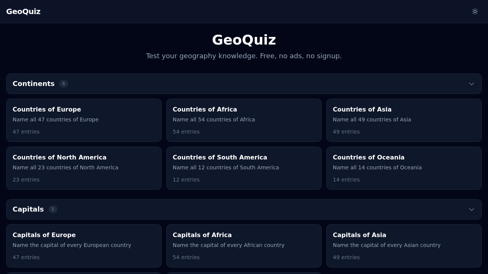
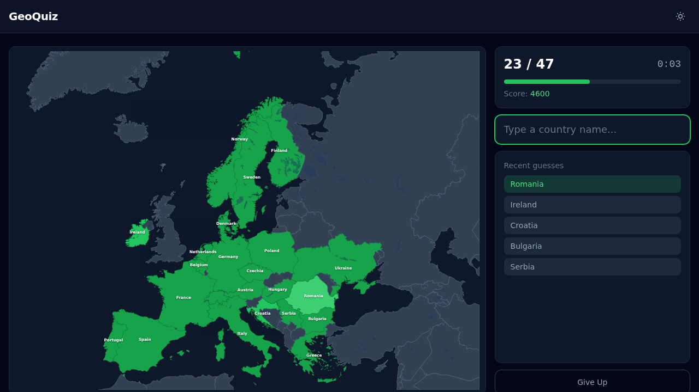

# GeoQuiz

A free, ad-free geography quiz game. Type country names, capitals, or presidents — answers match instantly as you type (no Enter key needed). Inspired by Sporcle.

**[Play it](https://evanoman.github.io/geoquiz/)**



## Quiz Types

### Map Quizzes

Type a country or state name and watch it light up on the SVG map. Labels appear at pre-computed centroids.



### Tabular Quizzes

For quizzes without maps (presidents, member states, etc.), a numbered grid reveals entries as you guess them.


## Quizzes

**19 quizzes** across 6 categories:

| Category | Quizzes |
|----------|---------|
| Continents | Europe, Africa, Asia, North America, South America, Oceania |
| Capitals | Europe, Africa, Asia, North America, South America |
| United States | US States, US State Capitals |
| Regional | EU Members, NATO Members, Middle East, Southeast Asia |
| History | US Presidents |
| Trivia | World's Largest Countries |

## Setup

No build step, no backend. Just static files.

```bash
git clone https://github.com/EvanOman/geoquiz.git
cd geoquiz
open index.html
# or
python -m http.server 9100
```

## How It Works

- **Architecture:** Static single-page app — vanilla JavaScript + Tailwind CSS (CDN), no backend, no build step
- **Routing:** Hash-based (`#/` for landing, `#/quiz/{id}` for quizzes)
- **Data:** Quiz definitions loaded from static JSON files
- **Maps:** SVG maps fetched and injected on demand, with ISO-coded element IDs for highlighting
- **Answer matching:** Input is normalized (lowercase, strip diacritics/articles/punctuation) and checked against a pre-built `Map` on every keystroke for instant O(1) matching

## Scripts

```bash
# Re-compute SVG label centroids after modifying maps
python scripts/compute_centroids.py
```

## License

MIT
